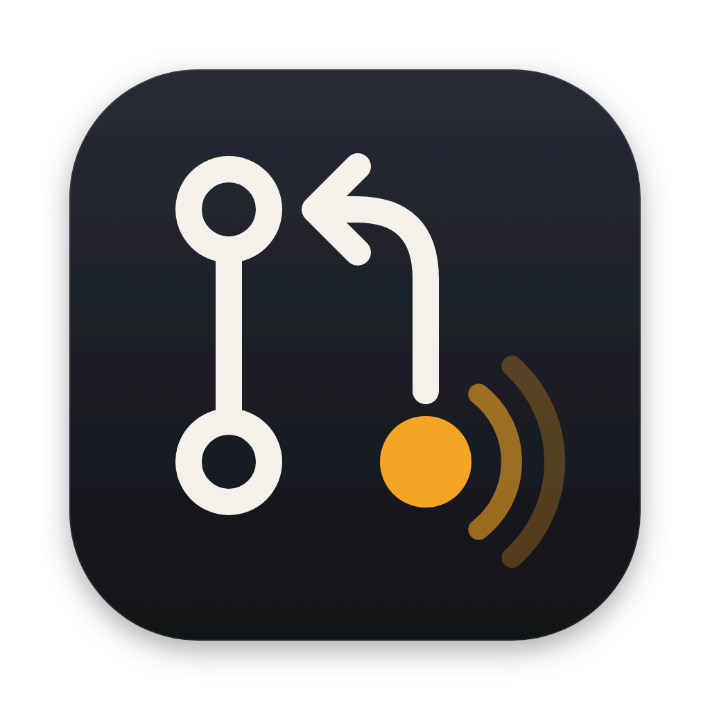

<p align="center"></p>

# gh-overview (`ghov`)

Shows only the GitHub pull requests waiting on you, across all your `gh` accounts, and won't let you forget them.

- **To review**: PRs where your review was requested and no one else has reviewed yet.
- **My PRs**: your PRs where it's your turn: an open thread, a changes request, or a comment you haven't answered.

A background daemon notifies you when a PR needs you and again every 5 minutes until you act on it or snooze it. There are no filters or queries to set up.

```
 gh-overview   [1] To review (2)   [2] My PRs (1)                                                      ● polled 12s ago
────────────────────────────────────────────────────────────────────────────────────────────────────────────────────────
  REPO                         #      TITLE                         WHY                            ALERT      ACCT
▶ octocat/dotfiles             310    [draft] PR 310                3 threads · changes: alice     🔔 pinging personal
────────────────────────────────────────────────────────────────────────────────────────────────────────────────────────
 enter open · s snooze · d done · r refresh · tab/1/2 switch · j/k move · q quit
```

## Install

Requires macOS 13+ and [`gh`](https://cli.github.com) logged in to every account you want to watch (`gh auth status`).

```bash
brew install pdrgds/tap/gh-overview
ghov install
```

`ghov install` starts the daemon and asks macOS for notification permission: choose **Options → Allow** (clicking the banner itself counts as Don't Allow). Then, in **System Settings → Notifications → gh-overview**, set the style to **Alerts** so notifications stay on screen until you act.

After `brew upgrade gh-overview`, run `ghov install` again to restart the daemon on the new version.

## Use

```bash
ghov            # open the TUI
ghov status     # daemon health, last poll per account, active alerts
ghov debug fetch --account <login>   # what the daemon sees for one account
ghov uninstall  # stop the daemon, clear its notifications, remove the LaunchAgent and notifier app
```

| Key | Action |
|---|---|
| `1` / `2` / `Tab` | switch tab |
| `j` `k` / `↑` `↓`, `g` `G` | move, top, bottom |
| `Enter` / `o` | open in browser; on My PRs, and on a review request with an alert, this also acknowledges (pauses pings for 30 minutes) |
| `s` | snooze the selected PR's alert |
| `d` | done: hide the PR until new activity arrives (for a review request, until you're asked again) |
| `a` | show or hide review requests someone else already reviewed |
| `r` | ask the daemon to poll now |
| `q` | quit |

Clicking a notification opens the PR and pauses its pings for 30 minutes; its Options menu has Snooze.

## Configuration

`~/.config/gh-overview/config.toml` is created on first run from `gh auth status`. Rename the labels to taste:

```toml
poll_interval = "1m"
renotify_interval = "5m"
remind_after_open = "30m"
tomorrow_hour = 9
snooze_choices = ["15m", "1h", "tomorrow"]
extra_bots = []
notify_team_requests = false

[[accounts]]
login = "octocat-work"
label = "work"
browser = { app = "Google Chrome", args = ["--profile-directory=Profile 1"] }

[[accounts]]
login = "octocat"
label = "personal"
```

`browser` is optional. It opens that account's PRs, from the TUI and from notification clicks, in a given app instead of the default browser; `args` are passed to the app, for example a Chrome profile directory (`chrome://version` shows it as the last part of **Profile Path**).

`extra_bots` lists machine-user logins that should be treated as bots (their conversation comments never notify).

The daemon reads the config once at startup: after editing it, run `ghov install` again to restart it. Only one daemon runs at a time.

## Details

### What's in each list

- **To review**: open PRs where you (or one of your teams) are a requested reviewer and no one else has reviewed yet. PRs another reviewer already approved, requested changes on or reviewed are hidden (the author's own replies don't count); press `a` to list them too, dimmed and labelled (for example `[changes: raad]`).
- **My PRs**: your open PRs with an unresolved review thread that someone else started and still has the last word on, changes requested on the current head commit, or a human comment newer than your last one.

### Notifications

**Your PRs.** A review or comment from someone else notifies. If the PR now needs you, it pings again every 5 minutes (`renotify_interval`) until it doesn't, listing everything new since you last acted, for example `alice requested changes · bob: 2 comments`. Approvals and other news that leave nothing to do notify once, without a Snooze button. Empty bot reviews (for example a CodeRabbit pass with no new comments) and bot conversation comments never notify.

**Review requests.** A new request for your review pings the same way until it leaves your To review list: you reviewed, the request was removed, someone else reviewed, or the PR closed. The notification names who asked, and a re-request notifies again even while the PR is still in your list. Drafts, bot-authored PRs and PRs someone else already reviewed never ping; a pinging request goes quiet if its PR goes back to draft, and pings again when it's marked ready unless you marked it done. Requests to one of your teams ping only with `notify_team_requests = true` (turning it on doesn't ping the team requests already waiting).

**Acting on a ping.**

- Clicking the notification body, or `Enter` in the TUI, opens the PR and pauses the pings for 30 minutes (`remind_after_open`); they resume if the PR still needs you.
- Snooze, from the notification's Options menu or `s`, pauses them until the time you pick.
- `d` stops them and hides the PR until new activity arrives.
- Closing the notification does not count as acting, so it pings again after 5 minutes.
- Pings stop on their own once the PR no longer needs you: threads resolved, you pushed after a changes request, or you replied.
- New activity that needs you cancels a snooze, a pause or done, and pings at once.

**Quiet start.** Nothing already there when the daemon first sees an account notifies: neither activity on your PRs nor review requests that were already waiting. A PR that shows up later notifies only for activity since about the previous poll, not for its history.

**Permission.** Until macOS allows notifications, the TUI header says so and the daemon falls back to `osascript` notifications, which have no buttons and may not appear at all; about a minute after you allow notifications it switches back and re-shows the alerts that are still pinging.

### How it works

- Every poll (1 minute by default) the daemon runs one GraphQL query per account against `api.github.com`, with a token it asks `gh auth token --user <login>` for on the spot; tokens are never written anywhere.
- What it has seen, the PR rows and each PR's alert state live in a local SQLite database that the TUI reads; the TUI sends acknowledgements, snoozes and refresh requests to the daemon through the same database.
- Notifications go through `GhOverview Notifier.app`, a small Swift helper (`notifier/main.swift`) that `ghov` embeds at build time and runs as one long-lived process next to the daemon, so clicks and snoozes on a notification reach the daemon.
- `ghov install` writes the notifier app to `~/Applications/GhOverview Notifier.app`, writes `~/Library/LaunchAgents/dev.pdrgds.gh-overview.plist` and starts the daemon. It copies your current `PATH` into the agent so it can find `gh`; run it again after moving `gh`.
- Nothing leaves your machine except the GitHub API requests.

### Files

- State: `~/.local/share/gh-overview/state.db`
- Daemon log: `~/.local/state/gh-overview/daemon.log` (trimmed to its last ~1 MB at startup once it passes 5 MB)

The app directories are created readable only by you (`0700`).

macOS may keep listing **gh-overview** in System Settings → Notifications after `ghov uninstall`; the entry is harmless.

## Build from source

Requires Rust 1.89+ and Xcode or the Command Line Tools (`swiftc` compiles the notifier app at build time).

```bash
git clone https://github.com/pdrgds/gh-overview
cd gh-overview
cargo install --path .
ghov install
```

## Development

```bash
cargo test
cargo clippy --all-targets -- -D warnings
cargo fmt --check
```

TUI rendering is covered by [insta](https://insta.rs) snapshots under `src/tui/snapshots`; review changes with `cargo insta review`. `build.rs` compiles the Swift notifier with `swiftc` on macOS; on other platforms it is skipped. The TUI and the polling core are portable; the daemon service and notifications are macOS-only for now.

Pushing a `v*` tag builds a universal macOS binary and attaches it to a GitHub release; then point the formula in [pdrgds/homebrew-tap](https://github.com/pdrgds/homebrew-tap) at it.

Issues and pull requests are welcome, especially for Linux support (a systemd user service and a notifier with actions).

## License

[MIT](LICENSE)
